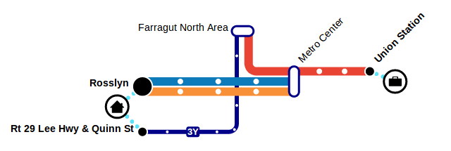
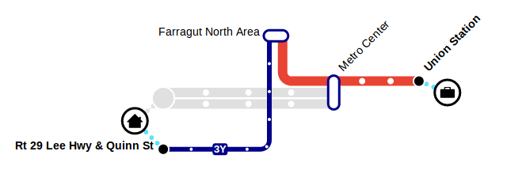

# transitive.js [![NPM version][npm-image]][npm-url] [![Build status][travis-image]][travis-url]

A tool for generating dynamic stylized transit maps that are easy to understand. Transitive takes in information describing specific transport network elements (routes, stops, journeys) -- typically produced by the OpenTripPlanner Profiler extension -- and produces a schematic map of those elements:



Dynamic styling of the network elements allows for interactivity and flexibility in the visual presentation. For instance, a single journey can be highlighted:



A Transitive map can be embedded as a freestanding web element or overlaid onto a [Leaflet](http://leafletjs.com/) map using the [Leaflet.TransitiveLayer](https://github.com/conveyal/Leaflet.TransitiveLayer) plugin.

Transitive is supported by the [Mobility Lab](http://mobilitylab.org/) [Transit Tech Initiative](http://mobilitylab.org/tech/transit-tech-initiative/). Read more in [this Mobility Lab article](http://mobilitylab.org/2014/04/16/the-technology-behind-a-new-kind-of-travel-planning/).

## Storybook

To view samples of Transitive in action, [check out the live Storybook](https://s3.amazonaws.com/transitive.js/index.html).

You can also run this locally with:

```bash
git clone https://github.com/conveyal/transitive.js
cd transitive.js
yarn start
# Go to http://localhost:5555 to view the storybook (the web page should open automatically)
```

### Usage of otp-ui

These stories rely on the [otp-ui](https://github.com/opentripplanner/otp-ui)
project to render transitive data on a Leaflet map. Specifically, it uses:
- @opentripplanner/base-map - renders a Leaflet base map
- @opentripplanner/core-utils - converts an OpenTripPlanner itinerary object into
  data that Transitive can read.
- @opentripplanner/transitive-overlay - copied from the otp-ui project and
  replaces the Transitive import with the local copy (useful for testing local
  changes)

### BYOD - Bring your own data

To test out how your own data (e.g., an OpenTripPlanner itinerary) would appear in
Transitive, try replacing the `itinerary` prop in the [Itinerary](https://s3.amazonaws.com/transitive.js/index.html?path=/story/example-transitive--itinerary) (for OpenTripPlanner itineraries) story (or `transitiveData`
in the [Profile](https://s3.amazonaws.com/transitive.js/index.html?path=/story/example-transitive--profile)
story).

You can also override the default style by adding a `style` prop. See a style
example here: https://github.com/conveyal/transitive-demo/blob/master/styles.js

## Demo

* [Demo of a freestanding Transitive map](http://conveyal.github.io/transitive.js)
* [Demo using Leaflet and Leaflet.TransitiveLayer](http://conveyal.github.io/Leaflet.TransitiveLayer)

## API

[See documentation here](https://github.com/conveyal/transitive.js/wiki/API-Documentation).

## See Also

- [conveyal/modeify](https://github.com/conveyal/modeify)

## License

MIT

[npm-image]: https://img.shields.io/npm/v/transitive-js.svg?maxAge=2592000&style=flat-square
[npm-url]: https://www.npmjs.com/package/transitive-js
[travis-image]: https://img.shields.io/travis/conveyal/transitive.js.svg?style=flat-square
[travis-url]: https://travis-ci.org/conveyal/transitive.js
